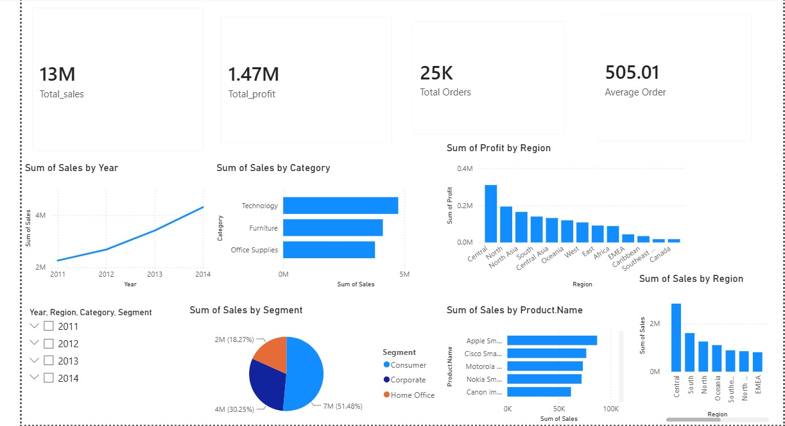

# Sales Performance Analysis

## Project Overview

This project analyzes sales data to identify sales trends, profitability, customer behavior, product performance, and regional performance.

The project uses SQL, Python, and Power BI to perform end-to-end data analysis and visualization.

## Tools Used

- MySQL
- Python
- Pandas
- Matplotlib
- Seaborn
- Power BI
- Excel/CSV

## Dataset

The project uses the Global Superstore dataset containing information about:

- Orders
- Customers
- Products
- Sales
- Profit
- Quantity
- Discounts
- Regions
- Categories

## Project Objectives

- Analyze overall sales performance
- Identify profitable categories
- Analyze regional performance
- Identify top-performing products
- Analyze customer segments
- Analyze yearly sales trends
- Build an interactive business dashboard

## SQL Analysis

SQL was used to calculate:

- Total Sales
- Total Profit
- Total Orders
- Average Order Value
- Sales by Category
- Profit by Region
- Top Products
- Top Customers
- Yearly Sales Trends

## Python Analysis

Python was used for:

- Data cleaning
- Missing-value analysis
- Duplicate detection
- Data type conversion
- Exploratory Data Analysis
- Sales analysis
- Profit analysis
- Category analysis
- Regional analysis
- Data visualization

## Power BI Dashboard

The Power BI dashboard includes:

- Total Sales
- Total Profit
- Total Orders
- Average Order Value
- Sales Trend by Year
- Sales by Category
- Profit by Region
- Sales by Customer Segment
- Top 10 Products
- Top 10 Customers

### Dashboard Preview



Interactive filters include:

- Year
- Region
- Category
- Segment

## Key Insights

- Technology generated the highest sales among the major categories.
- Consumer customers contributed the largest share of sales.
- Regional profitability varies significantly.
- Sales increased across the analyzed years.
- A small group of products contributes significantly to overall sales.

## Project Structure

```text
Sales-Performance-Analysis/
├── Dataset/
├── SQL/
├── Python/
├── PowerBI/
├── Images/
└── README.md